# CARE Integration Overview - Simple Guide

## 1. Individual App Workflows with CARE

### Genesys Cloud ↔ CARE
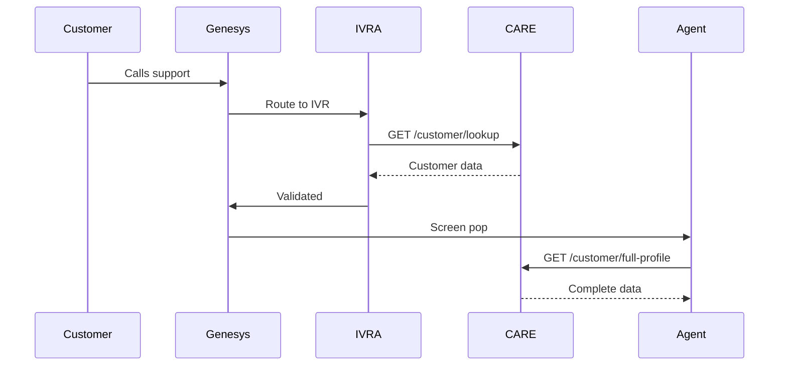
**What happens:** When a customer calls, the IVR system asks CARE to look up their account. CARE finds the customer and sends back their info. When the call reaches an agent, their screen automatically shows the customer's full profile from CARE, so the agent knows who they're talking to and can help immediately.

---

### BFF-chatbot.se → CARE
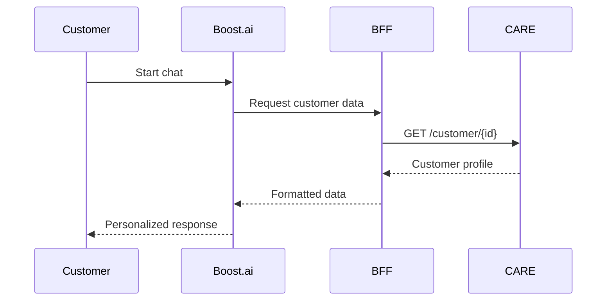
**What happens:** When a customer starts chatting on the website, the chatbot asks the BFF layer to get customer information. BFF requests the customer's profile and order history from CARE, formats it nicely for the chatbot, and the chatbot uses this to give personalized answers like "Hi Anna, I see your order #12345 is arriving tomorrow."

---

### Agent Workspace → CARE
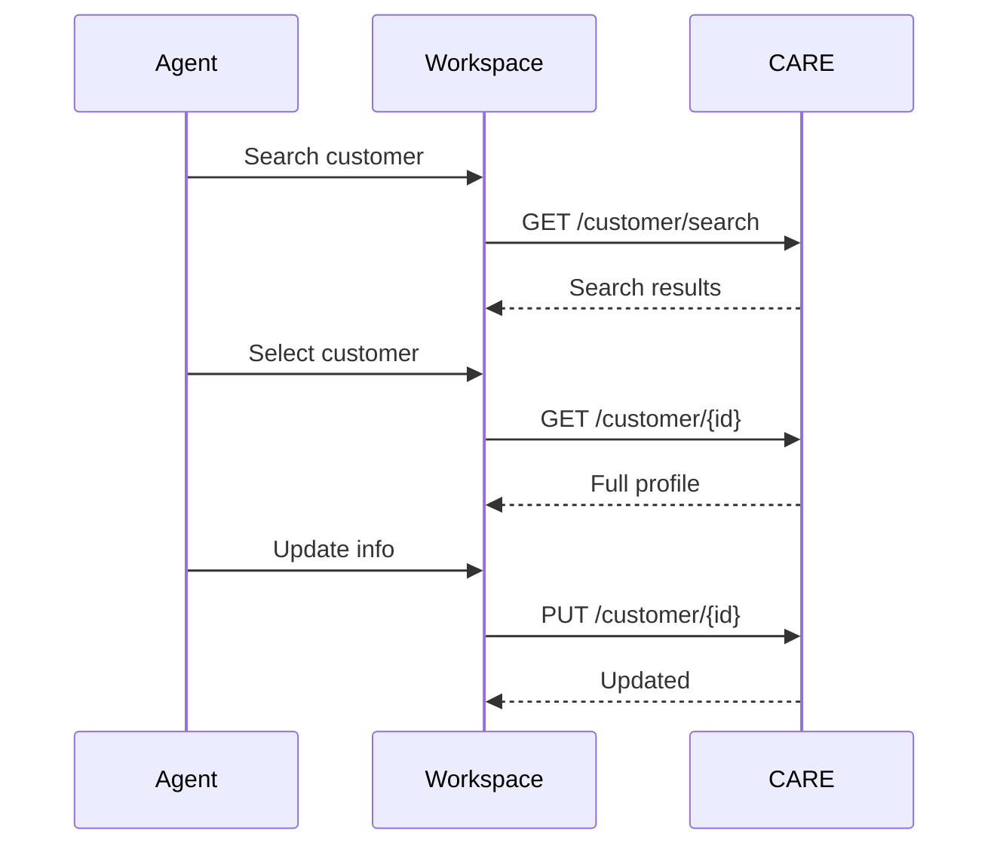
**What happens:** An agent types a customer name or phone number to search. CARE finds matching customers and shows them. The agent clicks on the right customer, and CARE displays their complete profile. If the agent needs to update something (like a new email address), they make the change and CARE saves it to the database.

---

### IVRA/NCCP → CARE
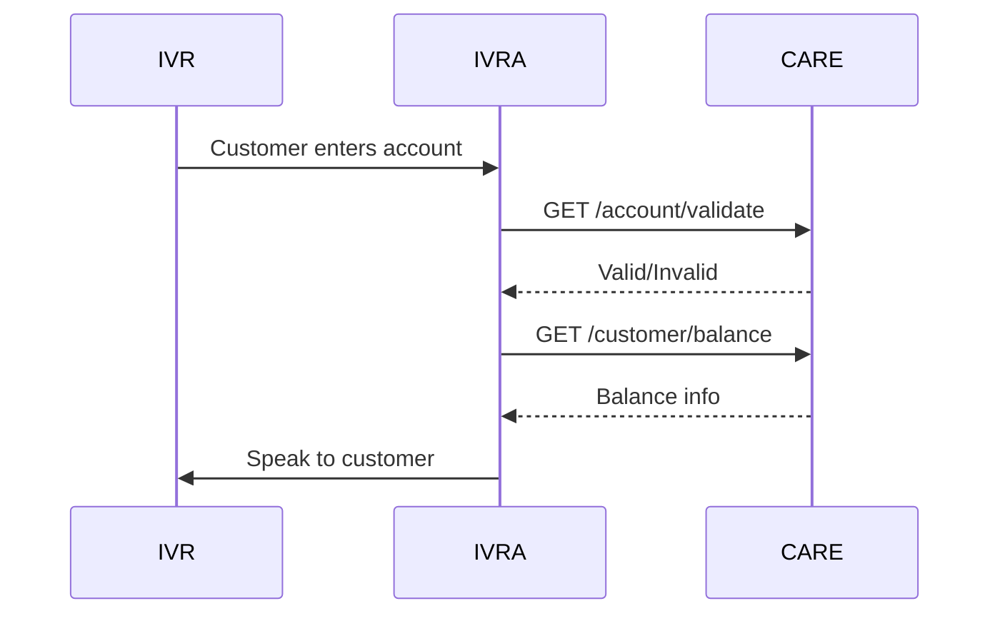
**What happens:** When a customer calls and enters their account number using the phone keypad, the IVR system checks with CARE if it's a valid account. If it is, CARE sends back the account balance and the IVR reads it out loud to the customer. This all happens automatically without needing an agent.

---

### CARE → Zendesk (via BIF-Ticket)
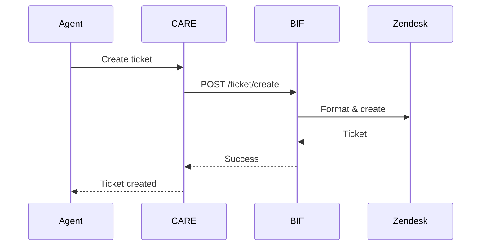
**What happens:** When an agent needs to create a support ticket for a customer issue, they click "create ticket" in CARE. CARE sends the customer information to BIF-Ticket, which formats it properly and creates the ticket in Zendesk. Zendesk gives back a ticket number (like #12345), and the agent can see it was successfully created.

---

### 3Speed → CARE
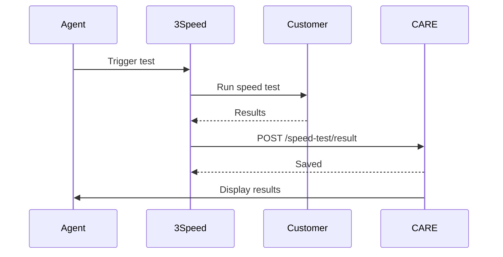
**What happens:** When a customer complains about slow internet, the agent clicks a button to run a speed test. 3Speed tests the customer's connection speed and gets the results. It then saves these results to CARE so they become part of the customer's history. The agent can immediately see if the internet is actually slow or working normally.

---

### CARE → CEL
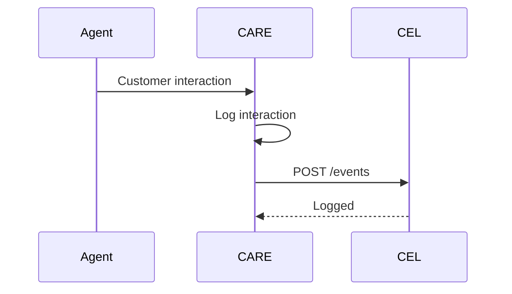
**What happens:** Every time an agent talks to a customer (phone call, chat, email), CARE automatically records what happened. It sends this information to CEL (Communication Event Log), which keeps a permanent record. This is important for compliance and so anyone can look back and see the complete history of customer interactions.

---

### eMite → CARE
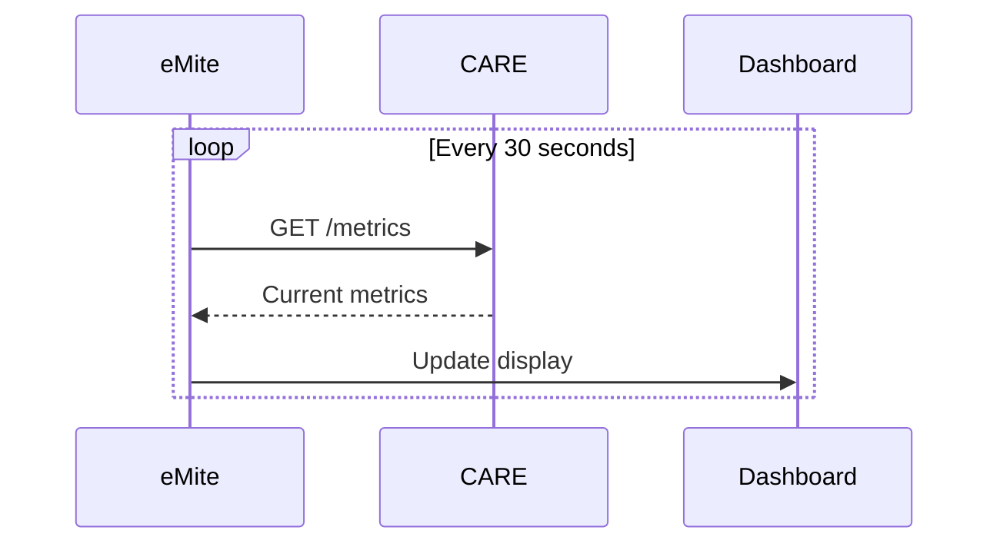
**What happens:** Every 30 seconds, the eMite dashboard checks in with CARE asking "how are things going?" CARE responds with current statistics like how many agents are working, how many customers are being helped, and system response times. eMite displays this on big screens so managers can monitor the contact center in real-time.

---

### CARE → Calabrio
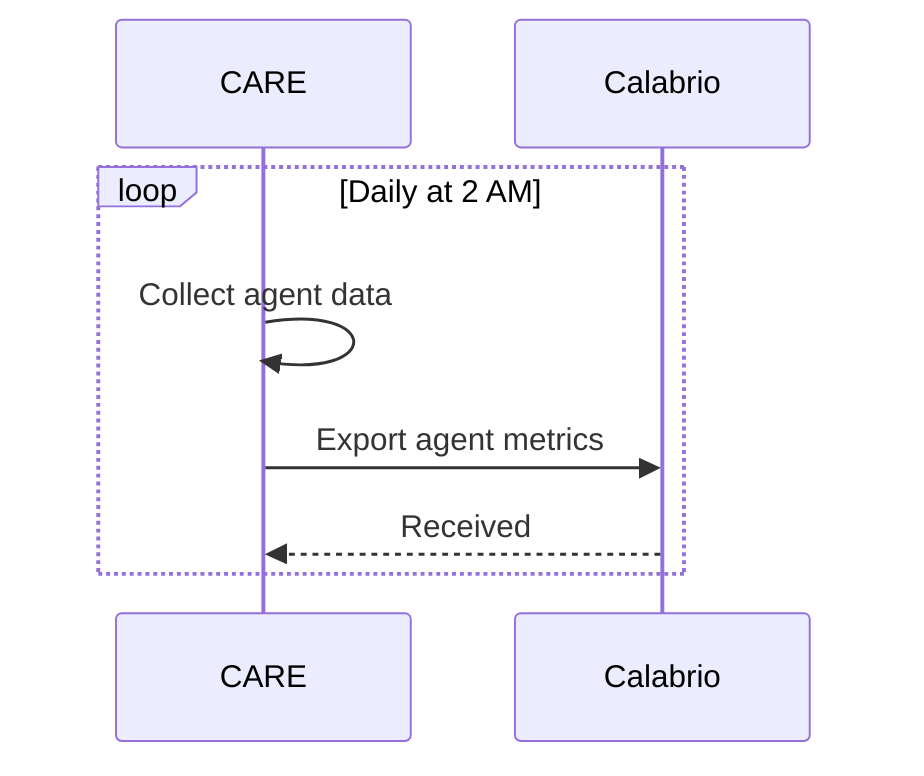
**What happens:** Every night at 2 AM when call volume is low, CARE packages up all the agent activity data from the day (how many calls handled, talk time, etc.) and sends it to Calabrio. Calabrio uses this data to help managers plan how many agents to schedule for different times and days based on patterns.

---

### CARE ↔ Backend Systems (via IVRA/NCCP)
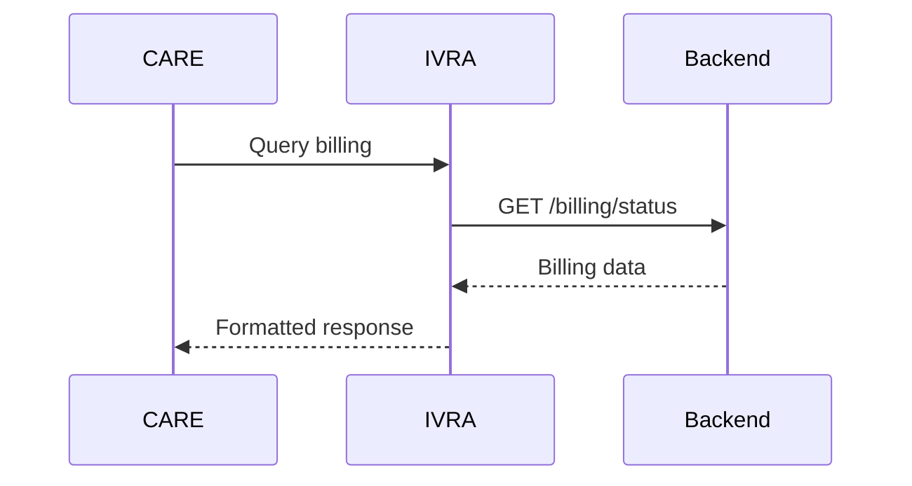
**What happens:** When CARE needs information from other business systems (like billing, orders, or service provisioning), it asks IVRA/NCCP to get it. IVRA acts like a translator and messenger, fetching the data from the right backend system and bringing it back to CARE in a format that CARE understands. This way CARE doesn't need to know about every single backend system.

---

## 2. Integration Patterns

| Pattern | Used By | Description |
|---------|---------|-------------|
| **REST API (Sync)** | Agent Workspace, IVRA/NCCP, BFF, eMite | Standard HTTP REST calls |
| **BFF** | BFF-chatbot.se | Backend For Frontend - specialized API layer |
| **API Gateway** | IVRA/NCCP | Single entry point to multiple backends |
| **Event-Driven** | CEL | Asynchronous event logging |
| **Batch Export** | Calabrio | Scheduled daily data export |
| **Polling** | eMite | Regular interval data fetching |
| **Service Mesh** | Backend Systems | Decoupled service communication via gateway |
| **REST via Middleware** | BIF-Ticket → Zendesk | Transformation layer between systems |

---

## 3. Integration Endpoints

### Customer Domain
```
GET    /willow/api/customer/{id}              - Get customer details
GET    /willow/api/customer/search            - Search customers
GET    /willow/api/customer/lookup            - Quick lookup (IVR)
GET    /willow/api/customer/full-profile      - Complete customer 360
POST   /willow/api/customer                   - Create customer
PUT    /willow/api/customer/{id}              - Update customer
DELETE /willow/api/customer/{id}              - Delete customer
```

### Account Domain
```
GET    /willow/api/account/{id}               - Get account info
GET    /willow/api/account/validate           - Validate account (IVR)
GET    /willow/api/account/balance            - Get balance
PUT    /willow/api/account/{id}               - Update account
```

### Orders Domain
```
GET    /willow/api/orders/{customerId}        - Get customer orders
GET    /willow/api/orders/{orderId}           - Get specific order
POST   /willow/api/orders                     - Create order
PUT    /willow/api/orders/{orderId}           - Update order status
```

### Communication Domain
```
POST   /willow/api/communication/log          - Log interaction
GET    /willow/api/communication/{customerId} - Get communication history
```

### Speed Testing Domain
```
POST   /willow/api/speed/test                 - Initiate speed test
POST   /willow/api/speed-test/result          - Store test results
GET    /willow/api/speed/results/{testId}     - Get test results
```

### Ticketing Domain
```
POST   /willow/api/ticket/create              - Create support ticket
GET    /willow/api/ticket/{ticketId}          - Get ticket status
PUT    /willow/api/ticket/{ticketId}          - Update ticket
```

### Metrics Domain
```
GET    /willow/api/metrics                    - Get current metrics (eMite)
GET    /willow/api/metrics/agent              - Get agent metrics
```

### Feature Toggles Domain
```
GET    /willow/api/featuretoggles             - Get enabled features
POST   /willow/api/featuretoggles             - Update feature state
```

---

## 4. Quick Reference - All Integrations

| System | Pattern | Direction | Priority | Key Endpoints |
|--------|---------|-----------|----------|---------------|
| **Genesys Cloud** | Bidirectional REST | BOTH | 🔴 CRITICAL | `/customer/lookup`, `/customer/full-profile` |
| **IVRA/NCCP** | API Gateway | INBOUND | 🟠 HIGH | `/account/validate`, `/customer/lookup` |
| **BFF-chatbot.se** | BFF | INBOUND | 🟠 HIGH | `/customer/{id}`, `/orders/{customerId}` |
| **Agent Workspace** | REST API | INBOUND | 🟠 HIGH | All CRUD endpoints |
| **Boost.ai** | Via BFF | INBOUND | 🟠 HIGH | Via BFF-chatbot.se |
| **BIF-Ticket** | REST Middleware | OUTBOUND | 🟠 HIGH | `/ticket/create` |
| **Zendesk** | Via BIF | OUTBOUND | 🟠 HIGH | Via BIF-Ticket |
| **3Speed** | Async REST | INBOUND | 🟡 MEDIUM | `/speed-test/result` |
| **eMite** | Polling REST | INBOUND | 🟡 MEDIUM | `/metrics` |
| **CEL** | Event-driven | OUTBOUND | 🟡 MEDIUM | `/events` |
| **Backend Systems** | Service Mesh | BOTH | 🟠 HIGH | Via IVRA/NCCP |
| **Calabrio** | Batch Export | OUTBOUND | 🟢 ASYNC | Daily export |
| **IDF Dialer** | Indirect | OUTBOUND | 🟢 ASYNC | Via Genesys |
| **Indicate Me** | Indirect | OUTBOUND | 🟢 ASYNC | Via Genesys |

---

## 5. Simple Architecture Diagram

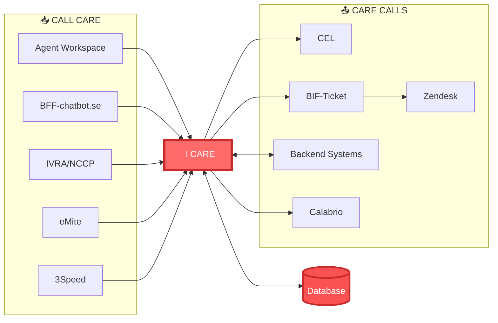

---

**Document Version:** Simple 1.0  
**Last Updated:** March 3, 2026
