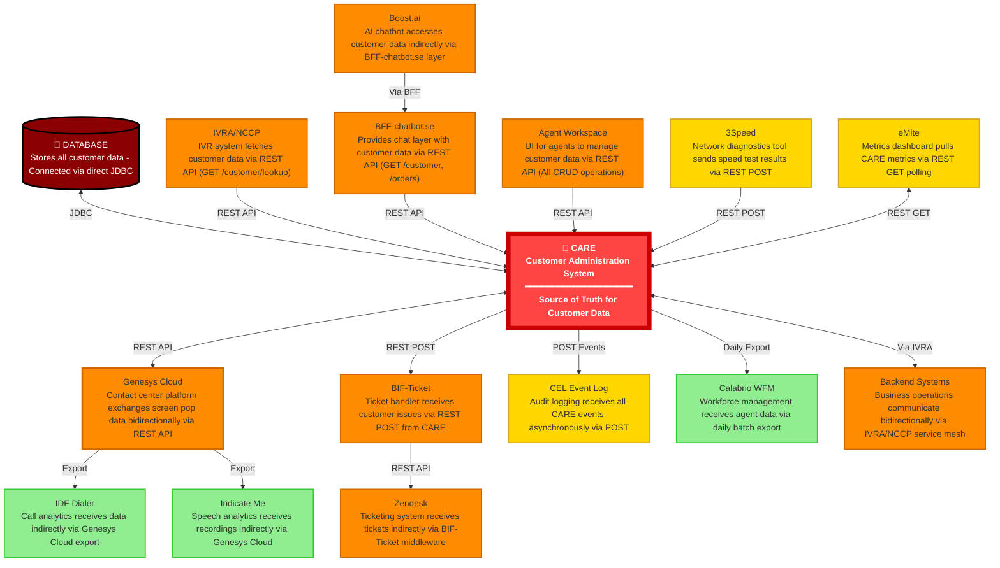
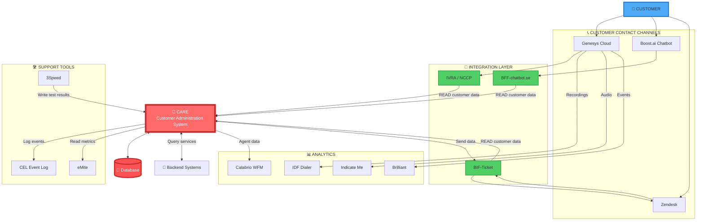
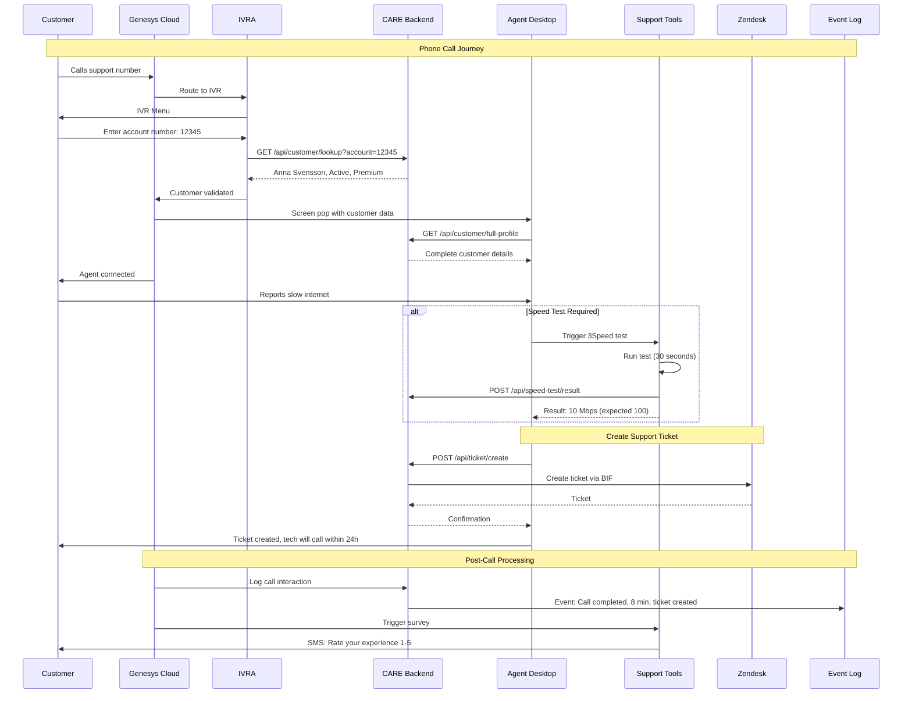
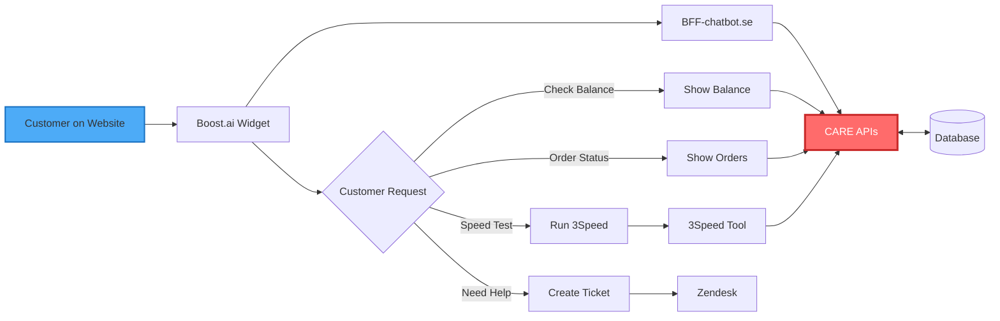
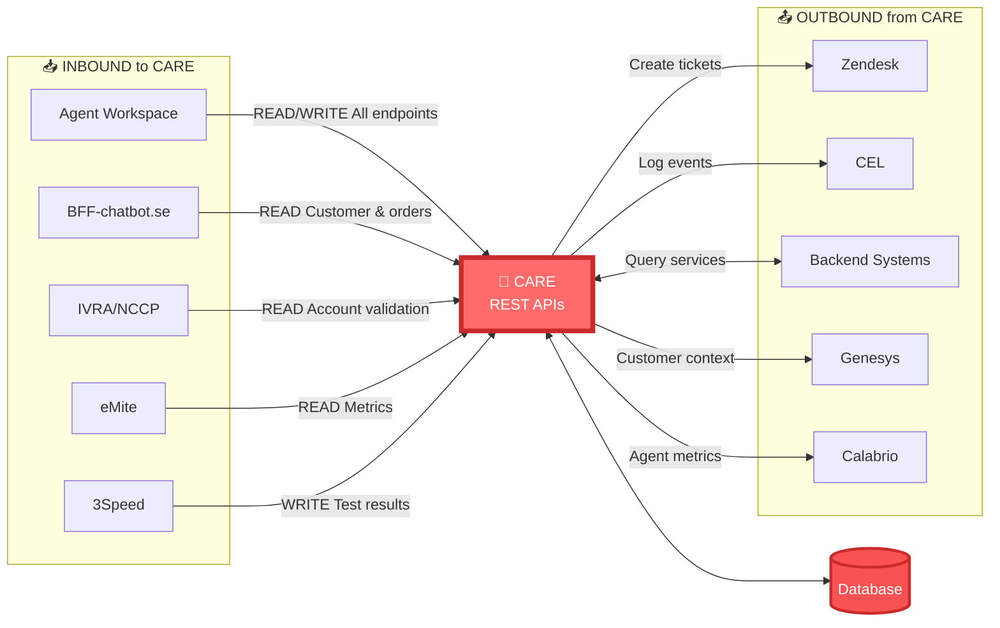
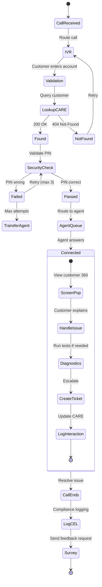
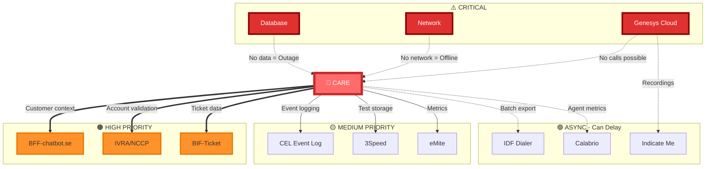

# CARE Integration Map
**Complete overview of CARE's integrations with external systems and endpoints**

---

## Table of Contents
1. [Visual Integration Overview](#visual-integration-overview)
2. [CARE as Central Hub](#care-as-central-hub)
3. [Inbound Integrations (Systems calling CARE)](#inbound-integrations-systems-calling-care)
4. [Outbound Integrations (CARE calling other systems)](#outbound-integrations-care-calling-other-systems)
5. [Data Flow Diagrams](#data-flow-diagrams)
6. [Integration Patterns](#integration-patterns)

---

## Visual Integration Overview

### 1. CARE Central Hub - 360° Integration View



**CARE Integration Summary:**

| System | What It Does & How It Communicates with CARE |
|--------|----------------------------------------------|
| **Database** | Stores all customer data - Connected via direct JDBC |
| **IVRA/NCCP** | IVR system fetches customer data via REST API (GET /customer/lookup) |
| **BFF-chatbot.se** | Provides chat layer with customer data via REST API (GET /customer, /orders) |
| **Genesys Cloud** | Contact center platform exchanges screen pop data bidirectionally via REST API |
| **Agent Workspace** | UI for agents to manage customer data via REST API (All CRUD operations) |
| **BIF-Ticket** | Ticket handler receives customer issues via REST POST from CARE |
| **Zendesk** | Ticketing system receives tickets indirectly via BIF-Ticket middleware |
| **Backend Systems** | Business operations communicate bidirectionally via IVRA/NCCP service mesh |
| **Boost.ai** | AI chatbot accesses customer data indirectly via BFF-chatbot.se layer |
| **3Speed** | Network diagnostics tool sends speed test results via REST POST |
| **eMite** | Metrics dashboard pulls CARE metrics via REST GET polling |
| **CEL** | Audit logging receives all CARE events asynchronously via POST |
| **Calabrio WFM** | Workforce management receives agent data via daily batch export |
| **IDF Dialer** | Call analytics receives data indirectly via Genesys Cloud export |
| **Indicate Me** | Speech analytics receives recordings indirectly via Genesys Cloud |

---

### 2. CARE Complete Integration Architecture



**System Functions:**

| System | Function | Dependencies |
|--------|----------|--------------|
| **CARE** | Customer profile, orders, subscriptions, history | Database |
| **Genesys Cloud** | Call routing, IVR, agent desktop, recordings | CARE APIs |
| **Boost.ai** | AI chatbot, 24/7 automated support | BFF layer |
| **IVRA/NCCP** | IVR to backend bridge, account validation | CARE APIs |
| **BFF-chatbot.se** | Chat data layer, customer lookup | CARE APIs |
| **BIF-Ticket** | Ticket creation handler  | CARE + Zendesk |
| **3Speed** | Network speed testing | CARE storage |
| **eMite** | Live metrics dashboard | CARE metrics API |
| **CEL** | Event logging for compliance | CARE events |
| **Calabrio** | Workforce management | CARE agent data |

---

### 2. Customer Service Agent Workflow



**Workflow Details:**
- **Average call duration:** 5-8 minutes
- **IVR lookup time:** < 200ms
- **Screen pop data:** Customer name, account status, recent orders, open tickets
- **Common diagnostics:** 3Speed network test (30 sec), account balance check
- **Escalation:** Creates Zendesk ticket with full context
- **Compliance:** All interactions logged to CEL for GDPR/audit

---

### 3. Chatbot Customer Journey



**Chatbot Capabilities:**
- **Self-service:** Balance inquiry, order status, service info
- **Diagnostics:** Trigger speed tests, check service status
- **Escalation:** Create tickets for agent follow-up
- **Languages:** Swedish, English
- **Context:** Pulls customer history from CARE
- **Availability:** 24/7 automated support

---

### 4. CARE Data Flow - Inbound vs Outbound



**API Operations Summary:**

**Inbound (Reading from CARE):**
- Agent Workspace: Full CRUD access to all customer data
- BFF-chatbot.se: `GET /customer`, `GET /orders` (read-only)
- IVRA/NCCP: `GET /account/validate` (read-only)
- eMite: `GET /metrics` (read-only)
- 3Speed: `POST /speed-test/result` (write only)

**Outbound (CARE calling others):**
- Zendesk: `POST /api/tickets` via BIF-Ticket
- CEL: `POST /events` for all interactions
- Backend Systems: Various REST APIs for billing, provisioning, orders
- Genesys: Screen pop data on call connect
- Calabrio: Daily export of agent activity

---

### 5. Real-Time Call Center Operations



**State Descriptions:**

| State | Duration | CARE Interaction | Notes |
|-------|----------|------------------|-------|
| IVR | 30-60 sec | None | Menu navigation |
| Validation | 2-5 sec | GET /customer/lookup | < 200ms API response |
| Security Check | 10-20 sec | Compare PIN hash | Max 3 attempts |
| Agent Queue | 0-120 sec | None | Target < 2 min wait |
| Screen Pop | Instant | GET /full-profile | Shows customer 360 |
| Handle Issue | 3-7 min | Various reads/writes | Main conversation |
| Create Ticket | 5-10 sec | POST /ticket/create | Via BIF to Zendesk |
| Log CEL | < 1 sec | POST /events | Compliance requirement |
| Survey | Async | None | Brilliant sends SMS |

---

### 6. System Dependencies & Priority



**Dependency Impact Analysis:**

| System | Priority | Impact if Down | Fallback Strategy | Recovery |
|--------|----------|----------------|-------------------|----------|
| **Database** | 🔴 CRITICAL | Complete outage | None - immediate escalation | < 15 min SLA |
| **Network** | 🔴 CRITICAL | No connectivity | None - infrastructure team | Immediate |
| **Genesys Cloud** | 🔴 CRITICAL | No calls | Vendor hotline | Vendor SLA |
| **IVRA/NCCP** | 🟠 HIGH | IVR can't validate | Route all to agents | 1-2 hours |
| **BFF-chatbot** | 🟠 HIGH | Chatbot degraded | Generic responses | 1-2 hours |
| **BIF-Ticket** | 🟠 HIGH | Can't auto-create tickets | Manual Zendesk entry | 2-4 hours |
| **CEL** | 🟡 MEDIUM | No audit logging | Queue events, replay later | 4-8 hours |
| **3Speed** | 🟡 MEDIUM | No diagnostics | Manual external tests | 4-8 hours |
| **eMite** | 🟡 MEDIUM | No live metrics | Use Genesys reports | Next day |
| **IDF Dialer** | 🟢 ASYNC | Delayed analytics | Batch catch-up | Next batch |
| **Indicate Me** | 🟢 ASYNC | No AI insights | Process backlog | Not time-critical |
| **Calabrio** | 🟢 ASYNC | No auto-scheduling | Manual schedules | Next day |

---

## CARE as Central Hub

**CARE - Customer Administration** is the central customer data repository that serves as the main hub for customer information across the entire ecosystem.

**Core Function:** 
- Stores and manages all customer information (personal details, account info, service subscriptions, contact history)
- Acts as the **source of truth** for customer data
- All other systems pull customer data from CARE or push updates to CARE

---

## Inbound Integrations (Systems calling CARE)

These systems **call CARE APIs** to retrieve or update customer information:

### 1. **BFF-chatbot.se** → CARE
**Integration Type:** REST API calls  
**Direction:** BFF calls CARE  
**Purpose:** Fetch customer data for personalized chatbot responses  
**Data Flow:**
- Customer uses chatbot on website
- BFF-chatbot.se requests customer info from CARE
- CARE returns: name, account details, order history
- Chatbot uses data to personalize responses

**Example API Calls:**
- `GET /willow/api/customer/{id}` - Get customer profile
- `GET /willow/api/orders/{customerId}` - Get customer orders
- `GET /willow/api/account/{id}` - Get account details

---

### 2. **Boost.ai** → CARE (via BFF-chatbot.se)
**Integration Type:** Indirect via BFF  
**Direction:** Boost.ai → BFF-chatbot.se → CARE  
**Purpose:** AI chatbot needs customer context  
**Data Flow:**
- Boost.ai chatbot handles customer conversation
- Calls BFF-chatbot.se for customer data
- BFF retrieves from CARE
- Chatbot provides personalized assistance

---

### 3. **Agent Workspace/Frontend** → CARE
**Integration Type:** Direct REST API calls  
**Direction:** Frontend calls CARE backend  
**Purpose:** Agents view and update customer information  
**Data Flow:**
- Agent searches for customer in portal
- Frontend calls CARE API
- CARE returns complete customer profile
- Agent can view/edit customer details

**Common Operations:**
- Search customers
- View customer details
- Update account information
- View service subscriptions
- View contact history
- Manage customer cases

---

### 4. **IVRA/NCCP** → CARE
**Integration Type:** REST API calls from IVR system  
**Direction:** IVRA/NCCP calls CARE  
**Purpose:** IVR needs customer data during phone calls  
**Data Flow:**
- Customer calls in and enters account number
- IVR (via IVRA/NCCP) calls CARE to validate account
- CARE returns account status, balance, etc.
- IVR speaks information to customer

**Example Scenarios:**
- Account balance inquiry
- Service status check
- Account validation
- Recent order lookup

---

### 5. **eMite Dashboard** → CARE
**Integration Type:** Read-only data access  
**Direction:** eMite reads from CARE  
**Purpose:** Display live metrics to contact center teams  
**Data Flow:**
- eMite pulls customer service metrics from CARE
- Displays real-time dashboard data
- Shows agent activity and customer interactions

---

### 6. **3Speed** → CARE
**Integration Type:** Writes speed test results to CARE  
**Direction:** 3Speed updates CARE  
**Purpose:** Store network speed test results  
**Data Flow:**
- Agent initiates speed test for customer
- 3Speed runs test via third-party API
- Results written back to CARE
- Agent sees results in CARE portal

---

## Outbound Integrations (CARE calling other systems)

These are systems that **CARE calls** to perform actions or retrieve external data:

### 1. CARE → **Zendesk** (via BIF-Ticket)
**Integration Type:** REST API calls  
**Direction:** CARE → BIF-Ticket → Zendesk  
**Purpose:** Create and manage support tickets  
**Data Flow:**
- Agent creates ticket from CARE
- CARE calls BIF-Ticket service
- BIF-Ticket formats data and creates ticket in Zendesk
- Ticket ID returned to CARE

**Operations:**
- Create support tickets
- Update ticket status
- Add notes to tickets
- Link customer to ticket

---

### 2. CARE → **CEL (Communication Event Log)**
**Integration Type:** Event logging  
**Direction:** CARE → CEL  
**Purpose:** Log all customer communications  
**Data Flow:**
- Any customer interaction in CARE (call, email, chat)
- CARE sends event to CEL
- CEL stores complete audit trail
- Searchable history for compliance

**Logged Events:**
- Customer phone calls
- Emails sent/received
- Chat conversations
- SMS communications
- Agent interactions

---

### 3. CARE → **Genesys Cloud** (via NCCP/IVRA)
**Integration Type:** Two-way integration  
**Direction:** Bidirectional  
**Purpose:** Contact center operations  
**Data Flow:**

**CARE → Genesys:**
- Trigger outbound calls
- Update customer interaction records
- Screen pop customer info to agents

**Genesys → CARE:**
- Call metadata
- Call recordings references
- Agent activity logs

---

### 4. CARE → **External Backend Systems**
**Integration Type:** REST APIs via IVRA/NCCP  
**Direction:** CARE → IVRA/NCCP → Backend Systems  
**Purpose:** Access business systems for customer services  
**Examples:**
- Billing systems
- Provisioning systems
- Product catalog
- Order management systems
- CRM systems

---

### 5. CARE → **Calabrio**
**Integration Type:** Data export for WFM  
**Direction:** CARE → Calabrio  
**Purpose:** Workforce management and scheduling  
**Data Flow:**
- CARE provides agent activity data
- Calabrio uses for forecasting and scheduling
- Contact volume statistics
- Agent performance metrics

---

### 6. CARE → **Brilliant** (Indirectly)
**Integration Type:** Event trigger  
**Direction:** CARE → Genesys → Brilliant  
**Purpose:** Trigger post-call surveys  
**Data Flow:**
- Call ends in Genesys
- Call metadata includes customer ID from CARE
- Brilliant uses customer info to send survey

---

## Data Flow Diagrams

### Customer Service Interaction Flow

```
Customer Contact
    ↓
Genesys Cloud (Phone/Chat)
    ↓
IVRA/NCCP (Integration Layer)
    ↓
CARE Backend ← → Frontend (Agent Workspace)
    ↓
CARE retrieves/updates:
├─→ Customer Profile
├─→ Account Details  
├─→ Service Subscriptions
├─→ Order History
└─→ Interaction History
    ↓
Agent assists customer
    ↓
CARE logs interaction → CEL (Communication Event Log)
    ↓
If ticket needed → BIF-Ticket → Zendesk
    ↓
Call ends → Brilliant sends survey
```

---

### Chatbot Interaction Flow

```
Customer visits website
    ↓
Boost.ai Chatbot (3SE or Hallon instance)
    ↓
BFF-chatbot.se (Backend for Frontend)
    ↓
CARE API
    ↓
Returns customer data:
├─→ Name
├─→ Account status
├─→ Recent orders
├─→ Service issues
└─→ Support history
    ↓
Chatbot provides personalized help
    ↓
If issue detected → Can create ticket via BIF-Ticket → Zendesk
    ↓
Or trigger speed test → 3Speed → Results to CARE
```

---

### Agent Support Tools Flow

```
Agent Workspace (Frontend)
    ↓
CARE Backend APIs
    ↓
Integrates with support tools:
    ↓
├─→ eMite (Live Metrics Dashboard)
│   Shows call queue, agent status
│
├─→ 3Speed (Network Diagnostics)
│   Run speed test for customer
│   Results stored in CARE
│
├─→ CEL (Communication History)
│   Full timeline of customer contacts
│
└─→ Zendesk (via BIF-Ticket)
    Create/view support tickets
```

---

### Analytics & Reporting Flow

```
Genesys Cloud (Call Data)
    ↓
IDF Dialer (Data Fetcher)
    ↓
SAS Database
    ↓
Business Intelligence Reports
    -----
Genesys Cloud (Call Recordings)
    ↓
Indicate Me (Speech-to-Text AI)
    ↓
AI Insights & Coaching Reports
    -----
CARE (Customer Interaction Data)
    ↓
CEL (Communication Event Log)
    ↓
Compliance & Audit Reports
```

---

## Integration Patterns

### 1. **BFF Pattern (Backend for Frontend)**
- **Example:** BFF-chatbot.se
- **Purpose:** Specialized API layer for chatbot needs
- **Benefit:** Chatbot gets exactly the data format it needs without exposing all CARE APIs

### 2. **API Gateway Pattern**
- **Example:** IVRA/NCCP
- **Purpose:** Single entry point for IVR to access multiple backend systems
- **Benefit:** IVR doesn't need to know about individual backend services

### 3. **Event-Driven Integration**
- **Example:** CARE → CEL
- **Purpose:** Asynchronous logging of all events
- **Benefit:** No blocking, guaranteed audit trail

### 4. **Synchronous REST APIs**
- **Example:** Frontend → CARE, BFF → CARE
- **Purpose:** Real-time data retrieval and updates
- **Benefit:** Immediate response for user-facing operations

### 5. **Service Mesh Integration**
- **Example:** CARE ↔ External Backend Systems via IVRA/NCCP
- **Purpose:** Decoupled service communication
- **Benefit:** Services can evolve independently

---

## CARE API Endpoints Overview

### Customer Domain
- `GET /willow/api/customer/{id}` - Get customer details
- `POST /willow/api/customer` - Create customer
- `PUT /willow/api/customer/{id}` - Update customer
- `GET /willow/api/customer/search` - Search customers

### Account Domain
- `GET /willow/api/account/{id}` - Get account info
- `PUT /willow/api/account/{id}` - Update account

### Orders Domain
- `GET /willow/api/orders/{customerId}` - Get customer orders
- `POST /willow/api/orders` - Create order

### Communication Domain
- `POST /willow/api/communication/log` - Log communication event
- `GET /willow/api/communication/{customerId}` - Get communication history

### Speed Testing Domain
- `POST /willow/api/speed/test` - Initiate speed test
- `GET /willow/api/speed/results/{testId}` - Get test results

### Feature Toggles Domain
- `GET /willow/api/featuretoggles` - Get enabled features
- `POST /willow/api/featuretoggles` - Update feature state

---

## Integration Security

### Authentication Methods
- **OAuth 2.0** - Used for external SaaS integrations
- **API Keys** - Used for internal service-to-service calls
- **JWT Tokens** - Used for frontend-to-backend authentication

### Authorization
- **Role-Based Access Control (RBAC)** - Agents have different permission levels
- **Scope-Based Permissions** - External systems limited to specific API scopes

---

## System Dependencies Map

```
CARE depends on:
├─→ H2 Database (local dev) / Production Database
├─→ CEL (for logging)
├─→ External Backend Systems (via IVRA/NCCP)
└─→ Zendesk (via BIF-Ticket)

Systems that depend on CARE:
├─→ BFF-chatbot.se
├─→ Boost.ai (indirectly via BFF)
├─→ Agent Workspace Frontend
├─→ IVRA/NCCP (for IVR data)
├─→ eMite (for metrics)
├─→ 3Speed (stores results in CARE)
├─→ Genesys Cloud (screen pop data)
└─→ Reporting Systems (via CEL)
```

---

## Critical Integration Points

### 1. **CARE ↔ Genesys Cloud** (Most Critical)
- **Why:** Core contact center functionality
- **Impact if down:** Agents can't get customer context during calls
- **Fallback:** Manual customer lookup

### 2. **CARE ↔ BFF-chatbot.se** (High Priority)
- **Why:** Customer-facing chatbot
- **Impact if down:** Chatbot can't personalize responses
- **Fallback:** Generic chatbot responses

### 3. **CARE ↔ Zendesk** (High Priority)
- **Why:** Ticket creation and management
- **Impact if down:** Can't create support tickets from CARE
- **Fallback:** Manual ticket creation in Zendesk

### 4. **CARE ↔ CEL** (Compliance Critical)
- **Why:** Legal audit trail requirement
- **Impact if down:** No communication logging
- **Fallback:** Queue events, replay when CEL is back

---

## Integration Monitoring

### Health Check Endpoints
All CARE integrations should implement health checks:
- `/actuator/health` - Overall system health
- `/actuator/health/database` - Database connectivity
- `/actuator/health/external-apis` - External API status

### Monitoring Tools
- **APM (Application Performance Monitoring)** - Track API response times
- **Logging** - Centralized logging for troubleshooting
- **Alerts** - Notifications when integrations fail

---

## Future Integration Opportunities

### Planned Integrations
1. **RPA Integration** - Automate repetitive tasks with CARE data
2. **Advanced Analytics** - Real-time dashboards pulling from CARE
3. **Mobile App** - Native mobile access to CARE APIs
4. **WhatsApp/Social Media** - New contact channels integrated with CARE

---

**Document Version:** 2.0  
**Last Updated:** March 3, 2026  
**Maintained By:** CARE Backend Team  
**Contact:** CARE Architecture Team for integration questions
