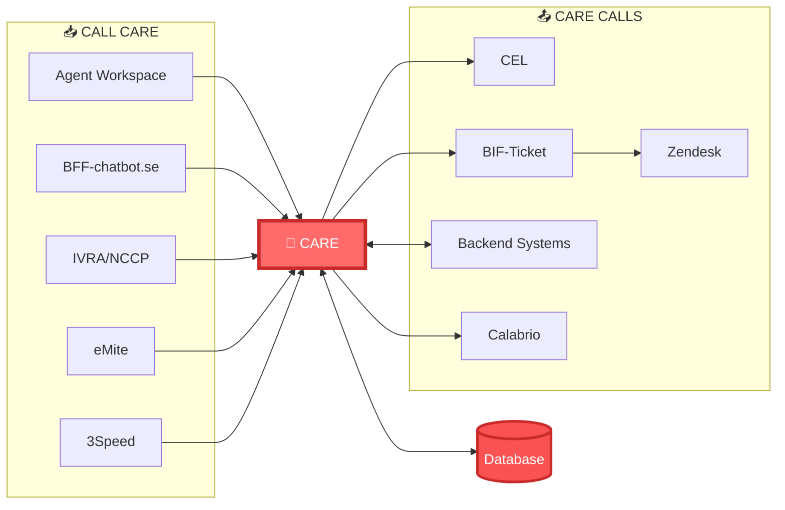

# CARE Integration Overview - Simple Guide

## 📚 Complete Documentation

| Document | Description | Link |
|----------|-------------|------|
| **Integration Overview** | Quick visual guide to all integrations (You are here) | [README.md](README.md) |
| **CCT Apps Catalog** | Complete catalog of all 21 contact center applications | [CCT-apps-description/](CCT-apps-description/) |
| **CARE Integration Map** | Complete integration documentation with patterns, endpoints, and workflows | [CCT-apps-description/CARE/integration-details/](CCT-apps-description/CARE/integration-details/) |

---

## 1. Integration Patterns

| Pattern | Used By | Description |
|---------|---------|-------------|
| **REST API (Sync)** | Agent Workspace, IVRA/NCCP, BFF, eMite | Standard HTTP REST calls |
| **BFF** | BFF-chatbot.se | Backend For Frontend - specialized API layer |
| **API Gateway** | IVRA/NCCP | Single entry point to multiple backends |
| **Event-Driven** | CEL | Asynchronous event logging |
| **Batch Export** | Calabrio | Scheduled daily data export |
| **Polling** | eMite | Regular interval data fetching |
| **Service Mesh** | Backend Systems | Decoupled service communication via gateway |
| **REST via Middleware** | BIF-Ticket → Zendesk | Transformation layer between systems |

---

## 2. Integration Endpoints

### Customer Domain
```
GET    /willow/api/customer/{id}              - Get customer details
GET    /willow/api/customer/search            - Search customers
GET    /willow/api/customer/lookup            - Quick lookup (IVR)
GET    /willow/api/customer/full-profile      - Complete customer 360
POST   /willow/api/customer                   - Create customer
PUT    /willow/api/customer/{id}              - Update customer
DELETE /willow/api/customer/{id}              - Delete customer
```

### Account Domain
```
GET    /willow/api/account/{id}               - Get account info
GET    /willow/api/account/validate           - Validate account (IVR)
GET    /willow/api/account/balance            - Get balance
PUT    /willow/api/account/{id}               - Update account
```

### Orders Domain
```
GET    /willow/api/orders/{customerId}        - Get customer orders
GET    /willow/api/orders/{orderId}           - Get specific order
POST   /willow/api/orders                     - Create order
PUT    /willow/api/orders/{orderId}           - Update order status
```

### Communication Domain
```
POST   /willow/api/communication/log          - Log interaction
GET    /willow/api/communication/{customerId} - Get communication history
```

### Speed Testing Domain
```
POST   /willow/api/speed/test                 - Initiate speed test
POST   /willow/api/speed-test/result          - Store test results
GET    /willow/api/speed/results/{testId}     - Get test results
```

### Ticketing Domain
```
POST   /willow/api/ticket/create              - Create support ticket
GET    /willow/api/ticket/{ticketId}          - Get ticket status
PUT    /willow/api/ticket/{ticketId}          - Update ticket
```

### Metrics Domain
```
GET    /willow/api/metrics                    - Get current metrics (eMite)
GET    /willow/api/metrics/agent              - Get agent metrics
```

### Feature Toggles Domain
```
GET    /willow/api/featuretoggles             - Get enabled features
POST   /willow/api/featuretoggles             - Update feature state
```

---

## 3. Quick Reference - All Integrations

| System | Pattern | Direction | Priority | Key Endpoints |
|--------|---------|-----------|----------|---------------|
| **Genesys Cloud** | Bidirectional REST | BOTH | 🔴 CRITICAL | `/customer/lookup`, `/customer/full-profile` |
| **IVRA/NCCP** | API Gateway | INBOUND | 🟠 HIGH | `/account/validate`, `/customer/lookup` |
| **BFF-chatbot.se** | BFF | INBOUND | 🟠 HIGH | `/customer/{id}`, `/orders/{customerId}` |
| **Agent Workspace** | REST API | INBOUND | 🟠 HIGH | All CRUD endpoints |
| **Boost.ai** | Via BFF | INBOUND | 🟠 HIGH | Via BFF-chatbot.se |
| **BIF-Ticket** | REST Middleware | OUTBOUND | 🟠 HIGH | `/ticket/create` |
| **Zendesk** | Via BIF | OUTBOUND | 🟠 HIGH | Via BIF-Ticket |
| **3Speed** | Async REST | INBOUND | 🟡 MEDIUM | `/speed-test/result` |
| **eMite** | Polling REST | INBOUND | 🟡 MEDIUM | `/metrics` |
| **CEL** | Event-driven | OUTBOUND | 🟡 MEDIUM | `/events` |
| **Backend Systems** | Service Mesh | BOTH | 🟠 HIGH | Via IVRA/NCCP |
| **Calabrio** | Batch Export | OUTBOUND | 🟢 ASYNC | Daily export |
| **IDF Dialer** | Indirect | OUTBOUND | 🟢 ASYNC | Via Genesys |
| **Indicate Me** | Indirect | OUTBOUND | 🟢 ASYNC | Via Genesys |

---

## 4. Simple Architecture Diagram



---

**Document Version:** Simple 1.0  
**Last Updated:** March 3, 2026
